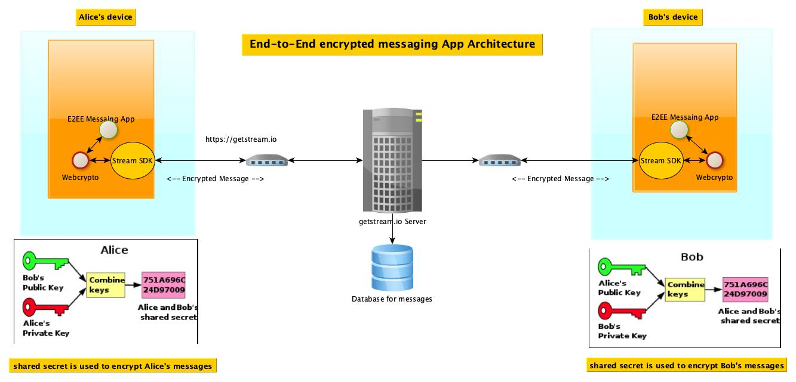

# End To End encrypted messaging App

## Secure Messaging App

The vast majority of messaging apps used globally today for communication between users or in group
settings use a simple standard SSL mechanism between the user's client device and server. For
example, the popular apps like Facebook Messenger, Snapchat, Instagram, Twitter etc do not do
end-to-end encryption. In these apps, the private messages could be potentially read by third
parties, organizations behind the apps. At times Government can inquire the hosting companies to
release the message history for a given user or for a communication channel in a group.

On the other hand there are handful of chat messaging applications such as WhatsApp, Signal do
either a limited or full end-to-end encryption. The end-to-end encryption measure prohibits others
from seeing the contents of the message except for sender the intended recipients. The best secure
chat applications are not only becoming more sought-after, they are also becoming crucial in today's
cyber security aware world!.

Here we have put our best efforts to create a secure end to end encryption messaging system using
the Flutter SDK and Stream SDK.

### Secure messaging app end-to-end architecture



In this App we are mkaing use of the following main SDKs, Clients, Components:
1. Flutter SDK for App Development.
2. Stream.io's SDK for chat client features
3. Stream.io's hosted backend for message store and forward to chant clients.
4. Flutter version of WebCrypto SDK for cryptographic operations.  


### This App uses Flutter SDK for App development.

#### Flutter at glance:
Flutter is an open source framework by Google for building beautiful, natively compiled,
multi-platform applications from a single codebase. It combines the ease of development with native
performance

#### Advantage of using Flutter for App development:

1. Apps built with Flutter can run on multiple operating Systems.
2. Same code base for UI and Business logic on All platforms.   
2. Flutter reduces the amount of code required, reduces time to market.
3. For developers it combines ease of development, testing and packaging for various platforms.

#### Installing Flutter:

Please follow this site for installing Flutter on your operating system of choice.
- [Install Flutter](https://docs.flutter.dev/get-started/install)

A few Flutter resources:
- [Lab: Write Flutter app](https://flutter.dev/docs/get-started/codelab)
- [Cookbook: Useful Flutter samples](https://flutter.dev/docs/cookbook)

For help getting started with Flutter, view our
[Flutter documentation](https://flutter.dev/docs), which offers tutorials, samples, guidance on
mobile development, and a full API reference.

Please make sure you are using the latest version of Flutter from the stable channel:

```dart
flutter channel

stable
flutter
upgrade
```

### The backend is implemented using the hosted messaging solution at https://getstream.io servers

Stream provides the hosted solution for messaging backend.
The stream backend could be customized to our needs  

Stream also provides the flutter client SDKs to support the rapid app development.

This application makes use of `stream_chat_flutter` SDK.
It is the official Flutter components for Stream Chat, a service for building chat applications.
at https://pub.dev/packages/stream_chat_flutter


Add `stream_chat_flutter` to the dependencies, to do that just open pubspec.yaml and add it inside
the dependencies section.

```dart
dependencies:flutter:sdk: flutter

stream_chat_flutter: ^3.1.1
```

Additionally `stream_chat_flutter_core` provides bare-bones implementation with logic
and builders for UI. For the most possible control, the `stream_chat` package allows access to the
low-level client.

The UI widgets uses the StreamChat or StreamChannel to manage the state and communication between
our app and the Stream Chat API.

### Flutter Chat SDK Features

1. Show participant watcher counts
2. Read state for all users in channel
3. Individual read state
4. User presence/online indicator
5. User's read states
6. Read indicators
7. Push notifications
8. GIF support
9. Light/dark themes
10. Style customization
11. UI customization
12. Offline support
13. Threads
14. Slash commands
15. Markdown messages formatting

### Flutter Advantages mind-map:


### About Stream's Flutter Chat SDK:


### E2E Secure Messaging


### Web Cryptography


### References:

"Top 8 Flutter Advantages and Why You Should Try Flutter on Your Next Project"
https://relevant.software/blog/top-8-flutter-advantages-and-why-you-should-try-flutter-on-your-next-project/

Flutter official dev site:
https://flutter.dev/

