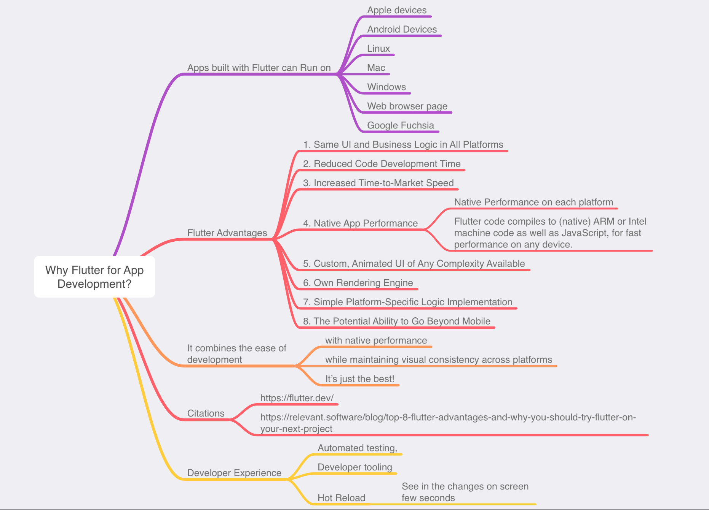
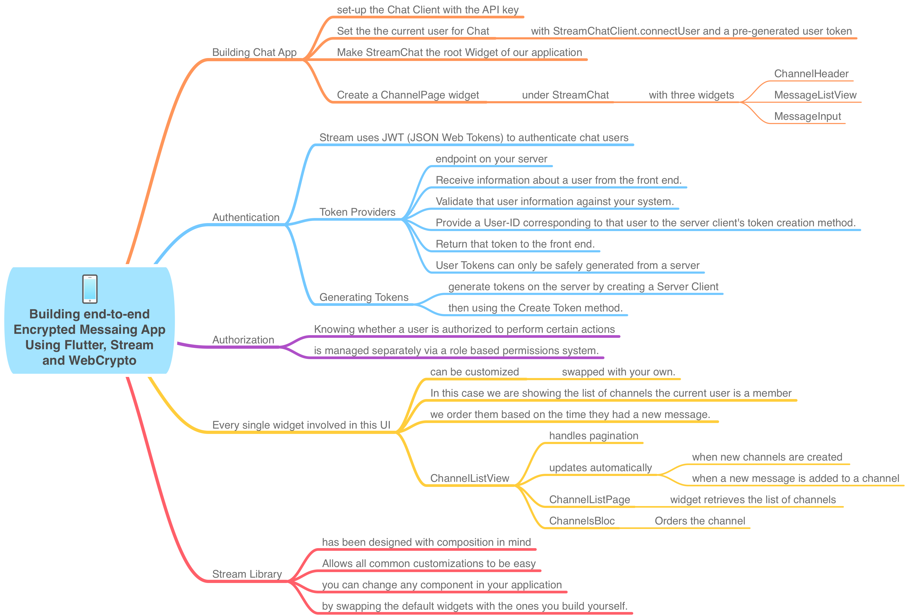
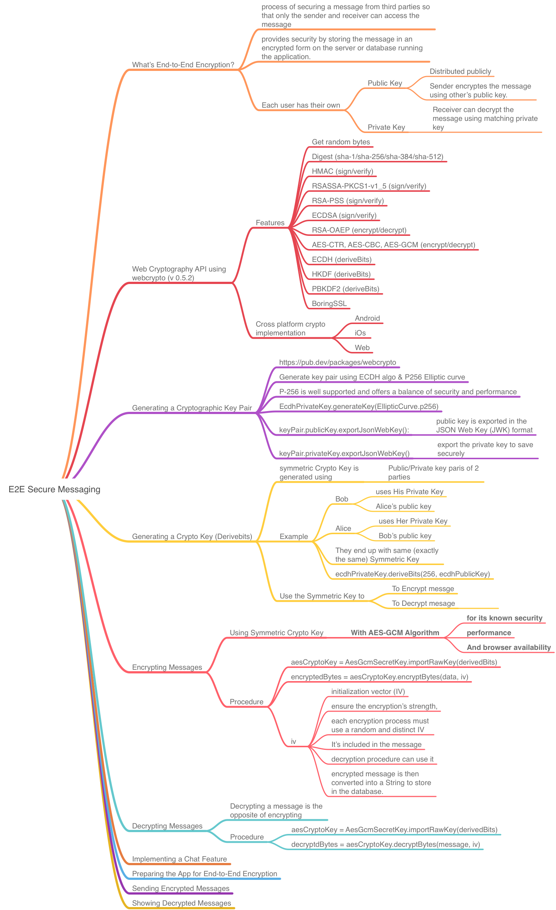
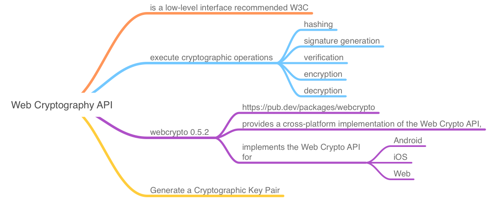

# End To End encrypted messaging App
Secure Messaging App

## Getting Started
### Why Flutter?

### About Stream SDK:

### E2E Secure Messaging 

### Web Cryptography

A few Flutter resources:
- [Lab: Write Flutter app](https://flutter.dev/docs/get-started/codelab)
- [Cookbook: Useful Flutter samples](https://flutter.dev/docs/cookbook)
- End-to-End Encryption Chat Messaging Application in Flutter utilizing Web Cryptography API (https://getstream.io/blog/end-to-end-encrypted-chat-in-flutter/)
- Web Cryptography API (https://www.w3.org/TR/WebCryptoAPI/)

For help getting started with Flutter, view our
[online documentation](https://flutter.dev/docs), which offers tutorials,
samples, guidance on mobile development, and a full API reference.
